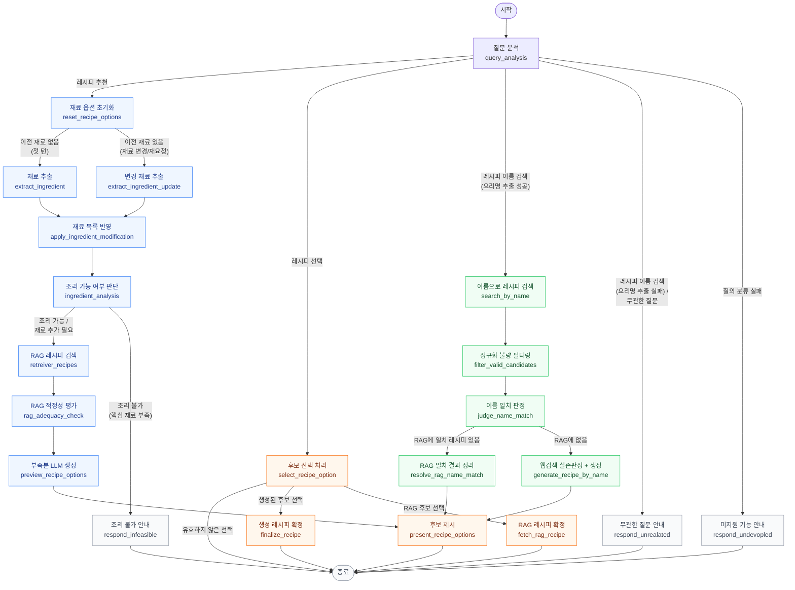
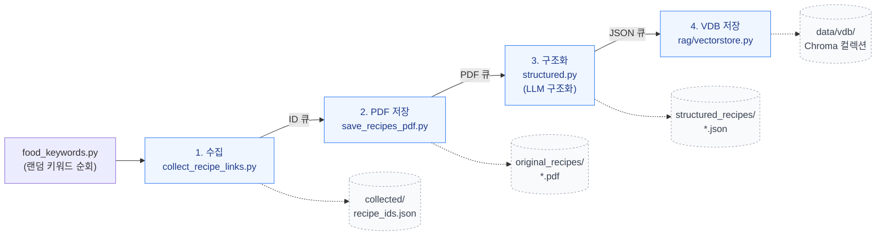

# Title: LLM 기반 요리 레시피 추천 어플리케이션 (LLM-based Recipe Recommendation Application)

## Description
직접 요리재료를 입력하면 요리레시피를 추천하고, 특정 요리 이름을 바로 검색해서 레시피를 확정할 수도 있는 LLM 어플리케이션.

📖 **사용자용 기능/사용 설명서**: [docs/사용설명서/레시피챗봇_사용설명서.md](docs/사용설명서/레시피챗봇_사용설명서.md)

---

## 기술 스택

| 분류 | 기술 |
| --- | --- |
| Backend | Python 3.14 · FastAPI (SSE 스트리밍) · `uv` (패키지 관리) |
| LLM 오케스트레이션 | LangChain · LangGraph (`StateGraph`, `MemorySaver` 체크포인터) |
| LLM Provider | Claude(Anthropic) · Google Gemini (순차 폴백 체인) |
| 임베딩 / 벡터 검색 | ChromaDB · `sentence-transformers`(로컬 CPU 임베딩, `BAAI/bge-m3`) |
| 웹 검색 | Tavily (요리 이름 검색 생성 폴백의 실존 여부 판정용, provider 교체 가능한 구조) |
| 데이터 수집 파이프라인 | Playwright (스크래핑) · `pypdf` (PDF 파싱) |
| 대화 로그 | SQLite (`conversation_log.py`) |
| 관측/평가 | LangSmith (트레이싱, `evaluate/`의 trace 분석 스크립트) |
| 인프라 / 배포 | Docker · GitHub Actions(CI/CD) · AWS EC2 · AWS S3(`boto3`, VDB·로그 백업) · Cloudflare(도메인/DNS) |

---
  
## Function
### Main
- 현재 가진 재료를 기반으로 레시피 생성(LLM) 및 검색(RAG)을 병합해서 레시피 추천        <--- **executable**
- 특정 요리 이름을 직접 말하면 레시피 검색 및 확정 (RAG에 여러 버전이 있으면 전부 제시, 매칭이 없으면 웹 검색으로 실존 여부를 확인한 뒤 생성)  <--- **executable**
### Sub
- 추가 재료가 필요한 레시피 추천 (부족한 재료 목록 함께 제시)                        <--- **executable**
- 대화 중 재료 추가/제거/교체("대파 대신 토마토로 변경해줘" 등) 반영 후 재추천          <--- **executable**
- "다른 거 없어?" 같은 재요청 시, 이전에 보여준 레시피와 겹치지 않는 새 후보를 재계산   <--- **executable**
- 재료명 동의어/상위-하위 개념 정규화(계란=달걀, 청사과⊂사과 등)로 매칭 정확도 향상        <--- **executable**
- 번호/이름/부정 표현("2번 말고 3번")까지 이해하는 레시피 선택                       <--- **executable**
- RAG 검색 결과의 재료 적정성 자동 평가(특수 재료 게이트 + 점수제)로 부실한 추천 필터링    <--- **executable**
- 정규화 불량(필수 필드 누락) RAG 데이터를 이름 검색 판정 전에 사전 필터링              <--- **executable**
- 동일 선택지 재선택 시 캐시 재사용으로 LLM 재호출 없이 즉시 응답                     <--- **executable**
- RAG 출처로 확정된 레시피에 원본 사이트 링크 표기                                <--- **executable**
- 요리 이름 검색에서 RAG 매칭이 없을 때, 웹 검색(Tavily, provider 교체 가능)으로 실존 여부를 먼저 확인한 뒤 생성 — 실존하지 않는 요리는 지어내지 않고 사용자에게 안내  <--- **executable**
- 대화 로그(질의/답변/노드경로/LLM provider별 호출 기록/RAG-생성 여부/소요시간)를 SQLite에 기록, 베타 기간 동안 S3에 주기적 자동 백업  <--- **executable**
- 레시피 데이터 수집 파이프라인(랜덤 키워드 수집 → PDF 저장 → LLM 구조화 → VDB 저장)      <--- **executable (수동 실행 + 서버 재시작 필요)**

---

## Flowchart

> `graph.py`(LangGraph `StateGraph` 정의)를 기준으로 그렸습니다. 서버 종료 시 자동 갱신되는
> [graph.png](graph.png)가 항상 실제 그래프의 원본이며, 아래 다이어그램은 그 구조를 사람이
> 읽기 쉬운 한글 라벨로 옮긴 것입니다. `undeveloped` 노드는 예외적인 분류 실패 시의 방어적
> 폴백 경로라 다이어그램에서는 생략했습니다.



---

## Data Pipeline

> `data_pipeline/recipe_pipeline.py` 기준. 자세한 옵션/주의사항은
> [data_pipeline/PIPELINE_사용법.md](data_pipeline/PIPELINE_사용법.md) 참고.

레시피 수집(랜덤 키워드) → PDF 저장 → LLM 구조화 → 벡터스토어(VDB) 저장까지 이어지는 4단계가
asyncio 큐로 연결되어 **동시에** 처리됩니다 (한 레시피가 구조화되는 동안 다음 레시피 수집이 이미 진행 중).



- **중복/재실행 안전**: `structure`/`vdb` 단계는 이미 처리된 항목(같은 `recipe_id`)이면 LLM/임베딩 API를
  호출하지 않고 무해하게 건너뜁니다 → 파이프라인을 중단 후 재실행해도 토큰 비용이 낭비되지 않습니다.
- **VDB 반영 시점**: 파이프라인이 저장한 새 레시피는 FastAPI 서버가 시작 시 1회만 VDB를 로드하므로,
  서버를 **재시작**해야 검색에 반영됩니다.
- 자세한 실행 방법은 아래 [실행방법 — 데이터 파이프라인](#데이터-파이프라인-레시피-수집기) 참고.

---

## RoadMap   
[docs/로드맵/Roadmap.md](docs/로드맵/Roadmap.md)   

---
## component(update: 2026.08.07)

> 개발/캐시 산출물(`__pycache__`, `.venv`, `.DS_Store`), 비어있거나 소스와 무관한 디렉토리(`app/`, `claude/`),
> 원본 스크래핑 데이터(`data_pipeline/original_recipes/`, `structured_recipes/`의 개별 파일), 런타임에만
> 생성되는 `data/`(VDB, 대화 로그 DB)는 구조 파악에 중요하지 않아 제외했습니다. 전체 목록은 `git ls-files` 참고.

```
chatbot_project/
├── Dockerfile
├── conversation_log.py          # 대화 로그 SQLite 기록 + S3 백업
├── llm.py
├── main.py
├── graph.py
├── graph.png                    # 그래프 다이어그램 (서버 종료 시 자동 갱신)
├── states.py
├── schems.py
├── ingredient_synonyms.py
├── ingredient_categories.py
├── food_combination_matcher.py
├── food_combination_taboo.json
├── pyproject.toml
├── uv.lock
│
├── nodes/
│   ├── analysis.py
│   ├── ingredients.py
│   ├── name_search.py           # 요리 이름 검색 흐름
│   ├── nodes.py
│   ├── preview_recipes.py
│   └── recipes.py
│
├── rag/
│   ├── config.py
│   ├── loader.py
│   ├── local_embeddings.py
│   ├── vectorstore.py
│   └── web_search.py            # 이름 검색 생성 폴백용 웹 검색 (provider 교체 가능)
│
├── templates/
│   ├── analysis_prompts.py
│   ├── ingredients_prompts.py
│   ├── name_search_prompts.py
│   ├── preview_recipes_prompts.py
│   ├── prompts.py
│   └── recipes_prompts.py
│
├── model/
│   └── model.py                 # 커스텀 트랜스포머 (자체 모델 실험용)
├── self_model/
│   └── loader.py                # 자체학습모델 연동 예정 자리
│
├── static/
│   └── index.html               # 프론트(백엔드가 그대로 서빙)
│
├── data_pipeline/                # 레시피 수집 파이프라인 (서버와 별개로 독립 실행)
│   ├── collect_recipe_links.py
│   ├── food_keywords.py
│   ├── recipe_pipeline.py
│   ├── save_recipes_pdf.py
│   ├── structured.py
│   ├── PIPELINE_사용법.md
│   ├── collected/
│   ├── original_recipes/
│   └── structured_recipes/
│
├── evaluate/                    # LangSmith trace 다운로드/분석 스크립트
│
├── docs/                        # 사용설명서 / 로드맵 / 회고록 / 테스트 결과 / 트러블슈팅 (부록 참고)
│   ├── 사용설명서/
│   ├── 로드맵/
│   ├── 회고록/
│   ├── 트러블슈팅/
│   ├── 기능테스트/
│   └── 실제로직테스트/
│
└── .github/workflows/
    └── deploy.yml                # CI/CD 배포 파이프라인
```

---
## version
### Patch Version (0.x.N) — Development Stage
- 0.x.1: alex's rag chain 
- 0.x.2: refactoring              
- 0.x.3: langgraph   <--- **now processing**
### Minor Version (0.N.x) — LLM Provider Branch
- 0.0.x: adapt model free gen ai(geminai, ollama, etc)
- 0.1.x: adapt model not free gen ai(claude)  <--- **now processing**
- 0.2.x: adapt model my gen ai

---

## 실행방법

`.env`의 `LLM_PROVIDER`(`"google"` 또는 `"claude"`) 및 해당 API 키가 설정되어 있어야 합니다.
백엔드(챗봇 서버)와 데이터 파이프라인(레시피 수집기)은 별개 프로세스입니다.

> 임베딩은 LLM 프로바이더와 무관하게 로컬 모델(`sentence-transformers`의 `BAAI/bge-m3`)을 사용합니다.
> API 키가 필요 없는 대신, 최초 실행 시 모델 가중치(약 2.27GB)를 다운로드합니다
> (Docker 이미지는 빌드 시점에 미리 받아두므로 컨테이너 기동 시 재다운로드가 없습니다).

### 추가로 필요할 수 있는 환경변수

| 변수 | 용도 | 필수 여부 |
|---|---|---|
| `SEARCH_PROVIDER` | 요리 이름 검색의 생성 폴백에서 쓸 웹 검색 엔진 (기본 `tavily`) | 이름 검색 생성 폴백 사용 시 |
| `TAVILY_API_KEY` | 위 검색 엔진 API 키 | 위와 동일 (없으면 검색 없이 실존 여부 판단, 정확도 저하) |
| `LANGSMITH_TRACING`, `LANGSMITH_API_KEY`, `LANGSMITH_PROJECT` | LLM 호출 추적/관측(LangSmith) | 선택 |
| `LOG_S3_UPLOAD`, `LOG_S3_BUCKET`(선택, 미지정 시 `VDB_S3_BUCKET` 재사용) | 대화 로그(`data/logs.db`)를 주기적으로 S3에 백업 | 배포 환경에서 선택 |

### 백엔드 (챗봇 서버)

FastAPI 서버 하나가 백엔드와 프런트(정적 페이지 서빙)를 모두 담당합니다.

~~~bash
cd chatbot_project
uv run uvicorn main:app --reload --port 8000
~~~

### 프론트 (웹 UI)

별도 서버 없이, 백엔드가 `/`에서 `static/index.html`을 그대로 서빙합니다.
백엔드를 먼저 띄운 뒤 브라우저로 접속하면 됩니다.

~~~
http://localhost:8000
~~~

`http://localhost:8000/docs`에서 FastAPI 자동 문서로 `/query`를 직접 호출해볼 수도 있습니다.

> 멀티턴(재료 추가/제거/변경 등) 테스트 시, 첫 응답으로 받은 `thread_id`를 이후 요청에도
> 그대로 실어 보내야 같은 대화로 이어집니다.

### 데이터 파이프라인 (레시피 수집기)

서버와 무관하게 독립 실행되는 스크립트로, 레시피를 수집(랜덤 키워드) → PDF 저장 →
LLM 구조화 → 벡터스토어(VDB) 저장까지 연속으로 처리합니다. 자세한 옵션은
[data_pipeline/PIPELINE_사용법.md](data_pipeline/PIPELINE_사용법.md) 참고.

~~~bash
cd chatbot_project

# 소량 테스트 (20개 처리 후 종료)
uv run python data_pipeline/recipe_pipeline.py --max-recipes 20

# 무제한 연속 실행 (Ctrl+C로 중단)
uv run python data_pipeline/recipe_pipeline.py
~~~

> 파이프라인이 저장한 새 레시피는 백엔드가 **재시작해야** 검색에 반영됩니다
> (서버는 시작 시 1회만 VDB를 로드합니다).

## Data Source
### Train & Rag Document
1. 만개의 레시피   
- URL: https://www.10000recipe.com/?srsltid=AfmBOooLjpoIMbvss7HL5iXygBMquTRGr-oGYMjopTBaFqNWWb5L2QuT
- 레시피 문서


### DB(미사용)

1. 식품의약품안전처(식품영양성분 데이터베이스)   
- URL: https://various.foodsafetykorea.go.kr/nutrient/general/down/list.do
- 요리 레시피 성분 및 칼로리 계산을 위한 데이터
- 생성한 답변 레시피의 재료와 DB의 성분표 매칭해서 성분 및 칼로리 계산

---

## 부록 (Appendix)

### 기능 테스트
그래프 전체가 아니라 일부 노드/함수만 직접 호출해서 검증한 테스트 기록.

- [테스트결과_00_개요](docs/기능테스트/20260807_0932_테스트결과_00_개요.md) — A~F 섹터 종합 요약, 수정 이력
- [A. 재료 변경 판단](docs/기능테스트/20260807_0932_테스트결과_A_재료변경판단.md)
- [B. RAG 적정성 평가](docs/기능테스트/20260807_0932_테스트결과_B_RAG적정성평가.md)
- [C. 재료명 정규화](docs/기능테스트/20260807_0932_테스트결과_C_재료명정규화.md)
- [D. 레시피 선택 및 캐싱](docs/기능테스트/20260807_0932_테스트결과_D_레시피선택캐싱.md)
- [E. 예외·엣지 케이스](docs/기능테스트/20260807_0932_테스트결과_E_예외엣지케이스.md)
- [F. 반복요청 중복방지 (신규 기능)](docs/기능테스트/20260807_0857_테스트결과_F_반복요청중복방지.md)
- [웹 검색 기반 요리 실존 판정 (1차)](docs/기능테스트/20260807_1047_기능테스트_웹검색_생성판정.md)
- [웹 검색 기반 요리 실존 판정 (2차 추가 10케이스)](docs/기능테스트/20260807_1044_기능테스트_웹검색_생성판정_추가10케이스.md)

### 실제 로직 테스트
컴파일된 그래프 전체를 `thread_id`와 함께 끝까지 실행해서 검증한 테스트 기록 (LangSmith Threads로 레이턴시/토큰/비용 조회 가능, latency 데이터 포함).

- [E2E 20케이스](docs/실제로직테스트/20260807_0949_실제로직테스트_E2E_20케이스.md) — 전체 흐름 스모크 테스트 + 노드별 성능
- [웹 검색 기반 요리 실존 판정 20케이스](docs/실제로직테스트/20260807_1130_실제로직테스트_웹검색기반요리실존판정_20케이스.md)
- ["다른 거 없어?" 분류 수정 검증](docs/실제로직테스트/20260807_1313_실제로직테스트_다른거없어_분류수정검증.md)

### 트러블슈팅

- [도메인 구매부터 배포까지 트러블슈팅 정리](docs/트러블슈팅/도메인%20구매부터%20배포까지%20트러블슈팅%20정리.md) — 2026-08-04 10:06
- [8/6 개발 및 배포 트러블슈팅 정리](docs/트러블슈팅/8월6일%20버그수정%20및%20배포%20트러블슈팅%20정리.md) — 2026-08-06 20:12
- [SSE 스트리밍 전환 트러블슈팅 정리](docs/트러블슈팅/SSE%20스트리밍%20전환%20트러블슈팅%20정리.md) — 2026-08-06 20:12
- [8/7 개발 트러블슈팅 정리](docs/트러블슈팅/8월7일%20개발%20트러블슈팅%20정리.md) — 2026-08-07 15:00
